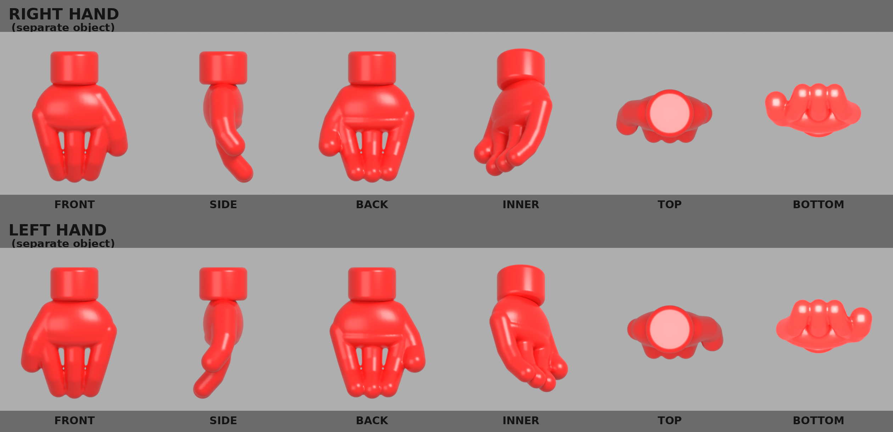
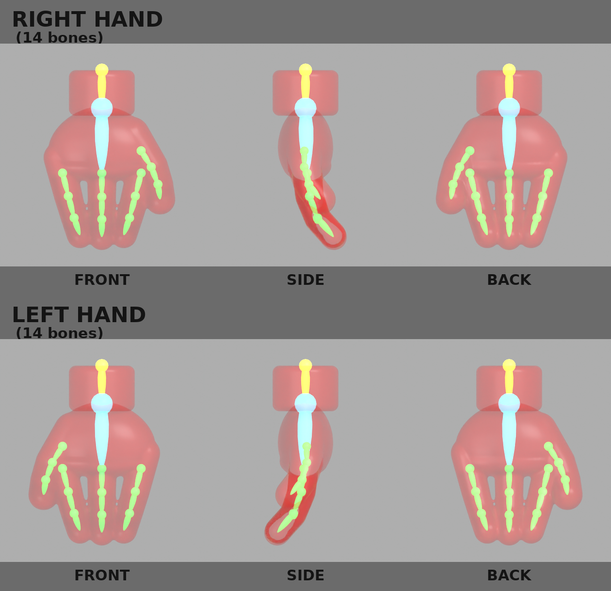
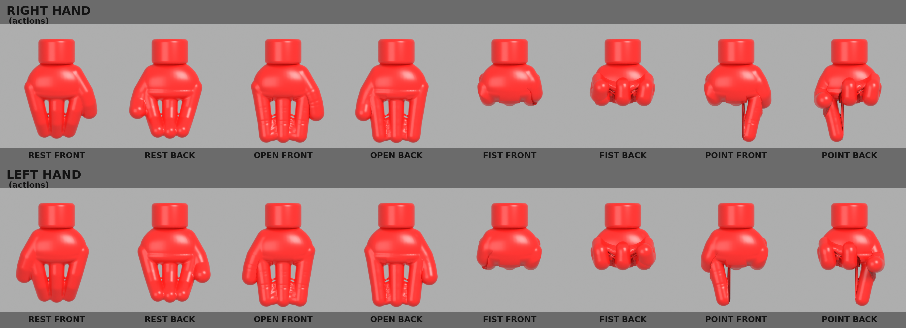

# Red Bean character (rigged) + first-person hands + rigged glove hands

Procedurally generated, fully rigged 3D model of the red bean mascot
(full-body reference sheet + first-person hand poses A/B/C), plus the two
glove hands from the hand reference sheet as separate rigged objects with
their own finger bones.






## Files

| File | What |
|---|---|
| `beanlib.py` | shared builders: primitives, open hand, armature, skin weights, poses, export, renders |
| `generate_character.py` | builds the full body, rigs it, exports and renders |
| `generate_fp_hands.py` | builds the first-person arms/hands viewmodel, rig, 3 poses, props |
| `red_bean.blend` | full body: `RedBean_Mesh` (one skinned mesh, 3 materials) + `RedBean_Rig` armature, actions `TPose` `Idle` `Fist` `Wave` |
| `red_bean.glb` | glTF binary with skin + the 4 actions as animations (Unity / Unreal / Godot / three.js) |
| `red_bean.fbx` | FBX with armature + baked actions |
| `red_bean.obj` + `.mtl` | static T-pose mesh (no rig) |
| `fp_hands.blend` | first-person: `FPHands_Mesh` + `FPHands_Rig`, `FP_Camera` (parented to the `Root` bone), actions `FP_Idle` `FP_HoldItem` `FP_PullDrag`, hidden props `Prop_Box` / `Prop_Bar` |
| `fp_hands.glb` / `fp_hands.fbx` | first-person hands with skin + the 3 actions |
| `renders/turnaround.png` | front / left / back / right, T-pose |
| `renders/rig.png` | bones drawn through a transparent body + hand close-up |
| `renders/poses.png` | TPose / Idle / Fist / Wave |
| `renders/fp_sheet.png` | first-person A. idle, B. hold item, C. pull / drag (from `FP_Camera`) |
| `generate_hands.py` | builds and rigs the two glove hands of the hand reference sheet |
| `hands.blend` | `Hand_R` + `Hand_R_Rig`, `Hand_L` + `Hand_L_Rig`: two separate skinned meshes (cuff + glove, ~29k verts each, one material `Hand_Red`) with a 14-bone armature each; actions `Rest` `Open` `Fist` `Point` per hand |
| `hands.glb` / `hands.fbx` | the same two hands with skins + the 8 actions (`Rest.R` … `Point.L`) |
| `hands.obj` + `.mtl` | the two hands as static meshes |
| `renders/hands_sheet.png` | front / side / back / inner / top / bottom of each hand, same layout as the reference |
| `renders/hands_rig.png` | the 14 bones drawn through each transparent hand |
| `renders/hands_poses.png` | Rest / Open / Fist / Point per hand, back and palm view |

Character is 2.0 m tall, Z-up, faces -Y (+X = the character's own left),
rest pose = T-pose with open hands, palms forward, thumbs up.

## Glove hands (`hands.blend`)

`Hand_R` and `Hand_L` are separate objects, exact mirrors of each other,
built in the rest pose of a character standing with the arms down: cuff on
top, fingers pointing down (-Z), back of the hand facing the viewer (-Y),
palm facing +Y, thumb toward the body (+X on `Hand_R`, -X on `Hand_L`).
The object origin is the wrist (centre of the cuff / glove seam); in the
file the hands sit at X = -0.35 (right) and X = +0.35 (left). Each hand is
0.34 m tall (cuff top to finger tips) and 0.24 m wide, i.e. the same scale
as the 2.0 m character.

Each mesh is one object of two shells: the bevelled cylinder cuff and the
glove (palm + 3 separate fingers + thumb), the latter fused from overlapping
primitives with a voxel remesh so it is a single closed, even quad surface.
The fingers are spaced so there is a clear gap between them. All dimensions
are named constants at the top of `generate_hands.py` (palm ellipsoids,
finger radii / segment lengths / spread / curl, thumb angles), so the pose
and proportions can be tweaked and regenerated.

Each hand has its own armature (14 bones):

```
Wrist ─ Hand ─┬─ Index.01 ─ Index.02 ─ Index.03
              ├─ Middle.01 ─ Middle.02 ─ Middle.03
              ├─ Ring.01 ─ Ring.02 ─ Ring.03
              └─ Thumb.01 ─ Thumb.02 ─ Thumb.03
```

The object origin / `Wrist` bone is the seam between cuff and glove, so the
hand can be parented to a wrist of any rig. Every vertex follows the bone
chain it is closest to (`beanlib.nearest_chain_weights`), blended around the
joints, so each finger bends on its own. Finger bones have local Z toward
the thumb: curl = rotate about local Z (+ on `Hand_R`, - on `Hand_L`),
spread = rotate about local X. Thumb bones have local Z = palm normal: flex
= rotate about local X (same sign on both hands), sweep toward the fingers
= rotate about local Z. `hand_pose()` in `generate_hands.py` builds a whole
hand pose from a few angles; the four shipped actions are examples.

## Rig

47 bones (full body), 33 bones (first-person). `.L` / `.R` suffixes work
with Blender's X-mirror pose tools. Bone collections: Body, Arm.L/R,
Fingers.L/R, Legs.

```
Root
└─ Hips ─ Spine ─ Chest ─ Head ─ Eye.L / Eye.R        (rotate Eye.* to move the pupils)
   │              └─ Shoulder.X ─ UpperArm.X ─ LowerArm.X ─ Hand.X
   │                                                     ├─ Index.01 ─ Index.02 ─ Index.03
   │                                                     ├─ Middle.01 ─ Middle.02 ─ Middle.03
   │                                                     ├─ Ring.01 ─ Ring.02 ─ Ring.03
   │                                                     └─ Thumb.01 ─ Thumb.02 ─ Thumb.03
   └─ UpperLeg.X ─ LowerLeg.X ─ Foot.X ─ Toe.X
```

First-person rig: `Root` (at the camera) → `Shoulder.X` → same arm/finger
chain as above. Moving `Root` moves camera and arms together.

Bone-local axes are set up so poses are easy to author by hand:

* every arm / finger bone: local **Y** along the bone, local **Z** toward the
  thumb side, local **X** = palm normal (left) / back of hand (right);
* **curl** a finger: rotate about local Z (negative on `.L`, positive on `.R`,
  see `ArmFrame.curl`);
* **spread** a finger: rotate about local X (positive = toward the thumb);
* **pronate** the forearm: rotate `LowerArm.X` about local Y.

`beanlib.curl_hand()` builds a whole hand pose from a few angles; see the
`make_poses()` functions for the shipped poses.

Weights are computed analytically (`beanlib.chain_weights`): each vertex is
projected onto its bone chain and blended with a smoothstep around every
joint, so fingers, elbows, knees and the spine bend cleanly without heat
weighting.

## Regenerate

```
pip install bpy pillow            # Blender 4.2 as a Python module
python3 character/generate_character.py character
python3 character/generate_fp_hands.py character
python3 character/generate_hands.py character
```

Add `--no-render` to skip the Cycles renders. The scripts also run inside
Blender: `blender -b -P character/generate_character.py -- character`.
